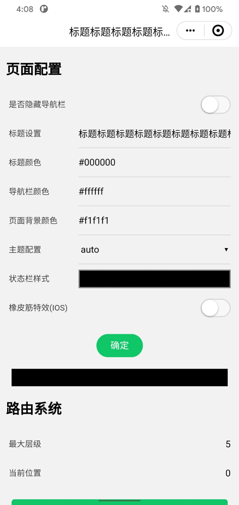

## light-web-electronjs
基于 android 对于 [light-web](https://github.com/amazingCoding/light-web-core) 跨端 webview 框架的开发支持。

## 使用
```Java
String loadZipURL = "";
boolen isDev = true;
int maxRouter = 5;
LightWebCoreActivity.createLightWebView(activity,loadZipURL,maxRouter,isDev);
```
由于 webview部分 使用了独立进程，需要对 Application 的 onCreate 事件进行区分

## 简介
